# OniTime

**OniTime** is a mobile application that merges time management with emotional well-being. It helps
users plan their day, track their mood, and develop healthy habits through a gamified and
interactive experience.

## About

OniTime is designed to support individuals in organizing their daily tasks while nurturing their
mental health. With an intuitive and friendly interface, the app seamlessly integrates personal
planning and emotional tracking in a playful and motivating environment.

  
The goal is to offer an accessible, encouraging, and practical tool that transforms personal
organization into a positive experience. Through its holistic approach, OniTime promotes both
productivity and emotional balance.

## Key Features

- **Daily Mood Tracking:** Log your emotions using five predefined states and write a daily journal.
  Each entry receives a personalized AI-generated letter in response.
- **Missions and Rewards:** Complete tasks to earn virtual coins that can be used to decorate your
  digital pet's home.
- **Chat Assistant:** Interact with your pet via a chatbot that offers support and reinforces
  emotional connection.
- **Recurring Task Automation:** Recurring tasks automatically reset on their assigned days,
  streamlining your daily planning.
- **Real-Time Sync:** Data is instantly synchronized across devices with Firebase.
- **Gamified Experience:** Earn login rewards, buy furniture, and keep motivated through game-like
  mechanics.
- **Intuitive UI:** A clean, user-friendly design with smooth navigation and customizable visuals.
- **Personalization Options:** Language selection and dark/light mode toggle.
- **Smart Notifications:** Intelligent alerts to remind users to complete tasks and track moods.

## Technologies

OniTime is built using:

- **Frontend:** `Kotlin` with `Jetpack Compose`
- **Date/Time Picker:** [
  `compose_multiplatform_date_time_picker`](https://github.com/Chaintech-Network/compose_multiplatform_date_time_picker)
- **Backend & Auth:** `Firebase` (Firestore and Authentication)
- **UI/UX Design:** `Figma` for wireframes and visual prototyping
- **Illustrations & Assets:** Created in `Paint`, including all pets, furniture, and decorations
- **Chat AI:** Powered by `Gemini` by Google

## 📱 Screens

1.  **Splash:** Initial loading screen.

    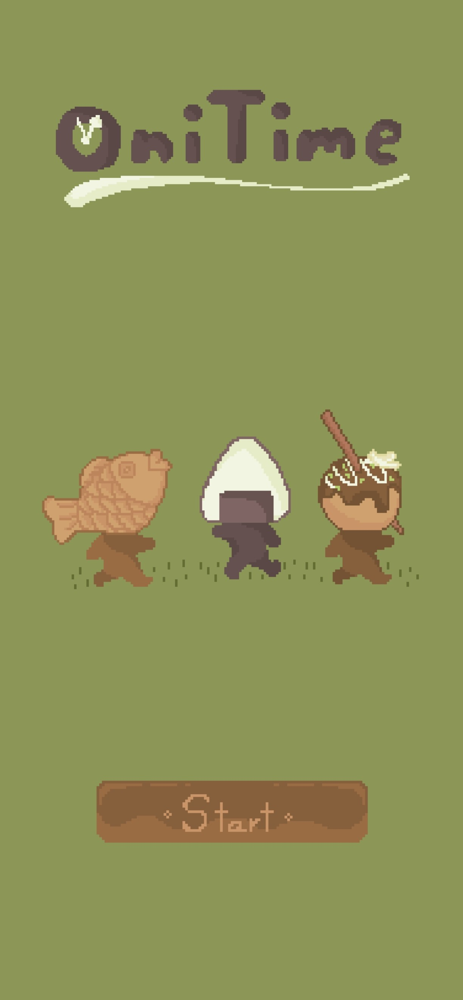

2.  **Login:** Secure login screen for returning users.
    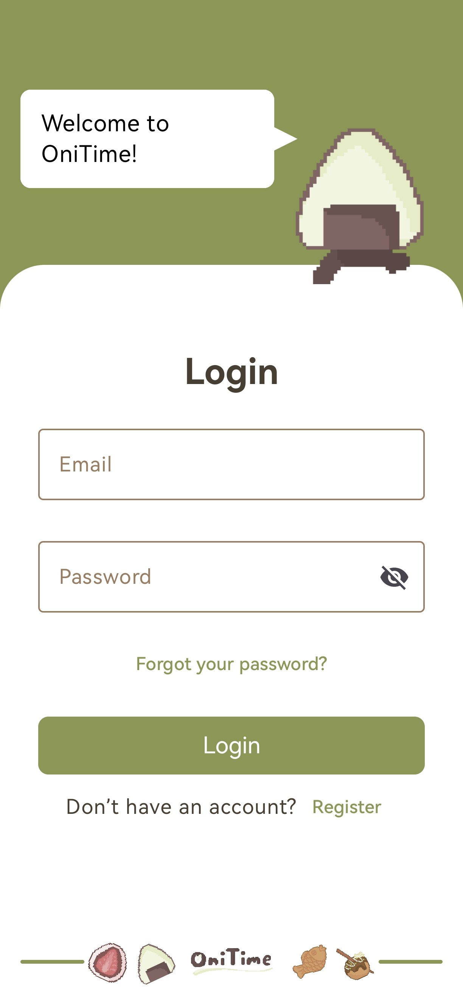

3.  **Register:** Multi-step sign-up process for new users.
    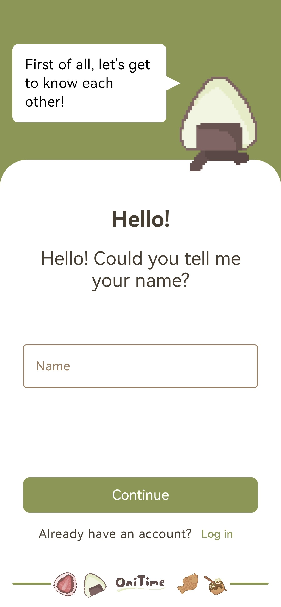
    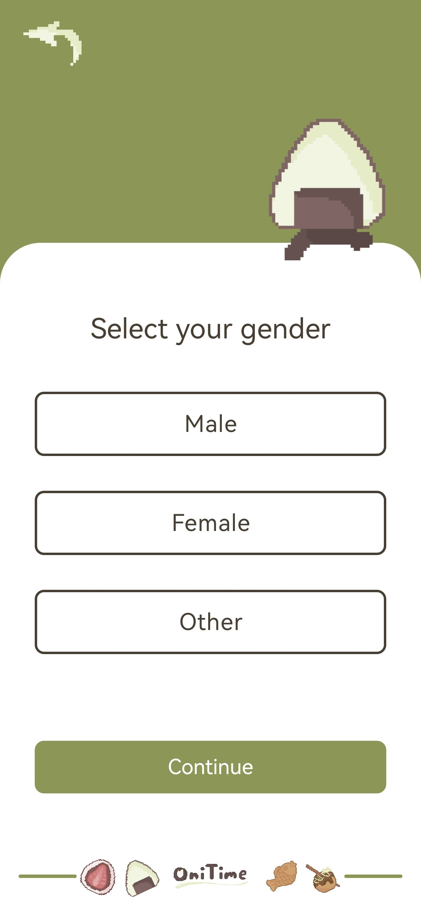
    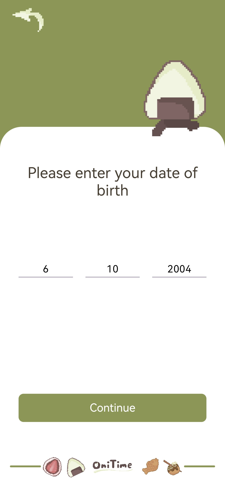
    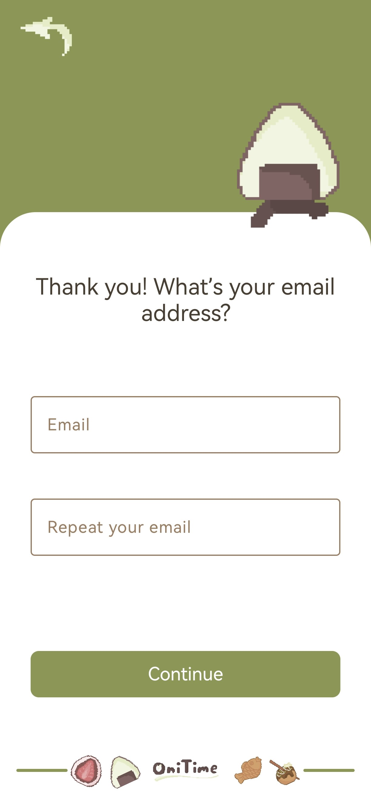
    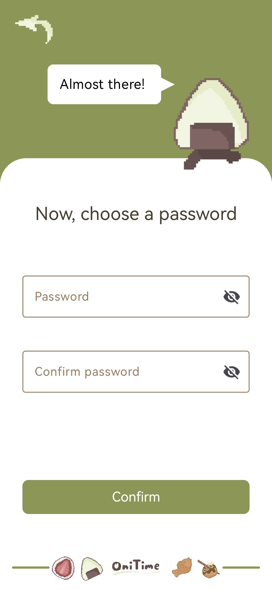

4.  **Home:** Split view showing the pet’s home and the user’s task list with edit, delete, and
    complete options.
    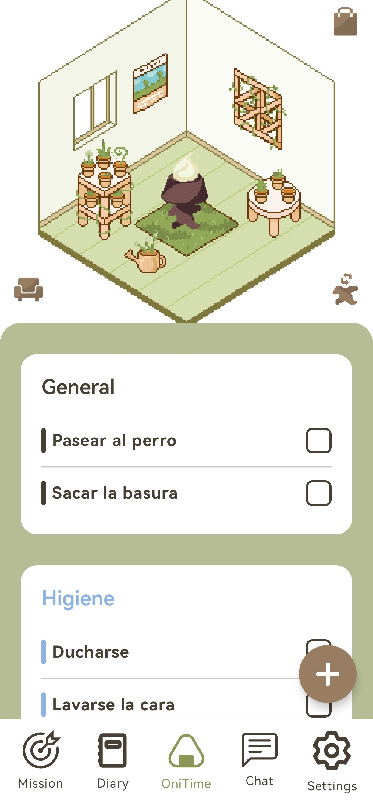

5.  **Add Task:** Input task details, repeat settings, reminders, and group assignments.
    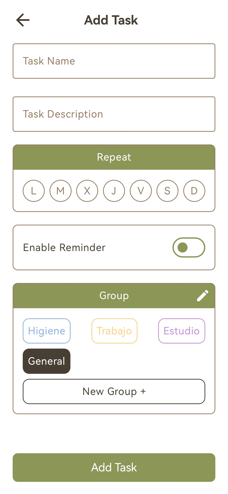

6.  **Group Manager:** Create and delete groups with custom names and color labels.
    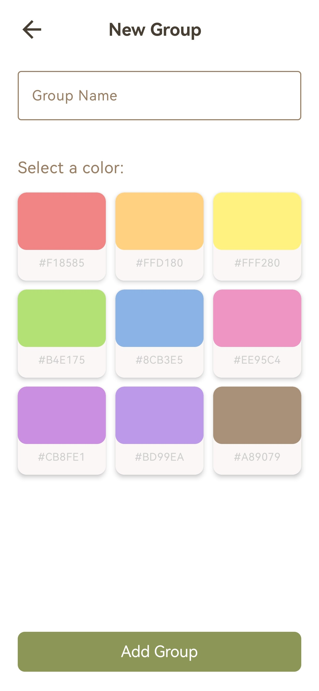

7.  **Inventory:** View all owned furniture without the pet present.
    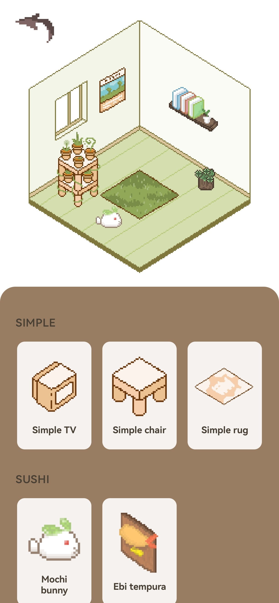

8.  **Store:** Browse and purchase furniture by category using collected coins.
    

9.  **Pet Catalog:** Choose your digital companion from the available pets.
    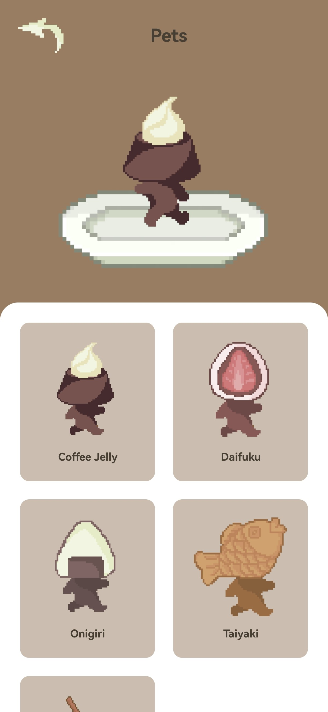

10. **Pet Chat:** Chat with your AI-powered pet assistant.
    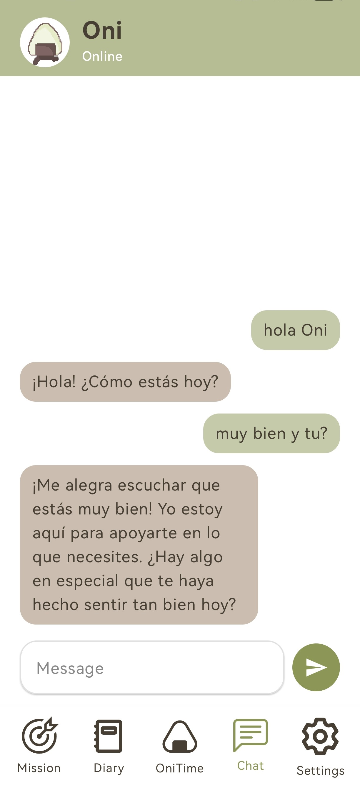

11. **Missions:** Complete predefined challenges to earn additional rewards.
    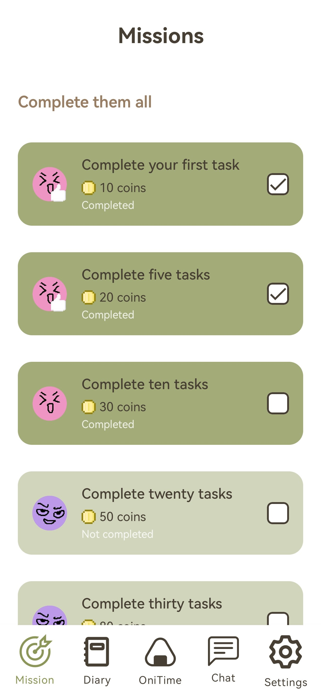

12. **Settings:** Change profile details, language, theme, notifications, and access legal documents
    or the website.
    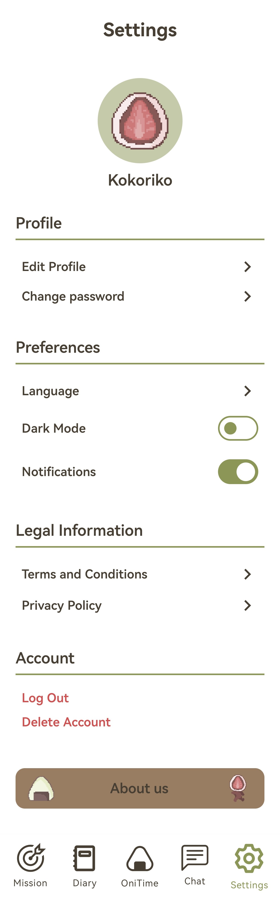

13. **Daily Streaks:** Claim daily rewards for consistent app usage.
    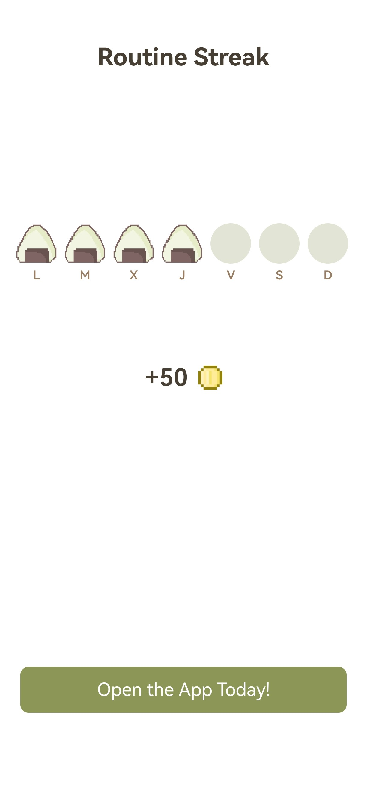

14. **Diary:** View with a calendar with emotion icons and access past entries to edit or delete.
    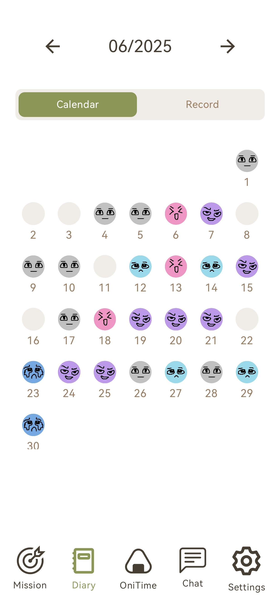

15. **Mood Tracker:** Choose from five moods and write a daily journal entry.
    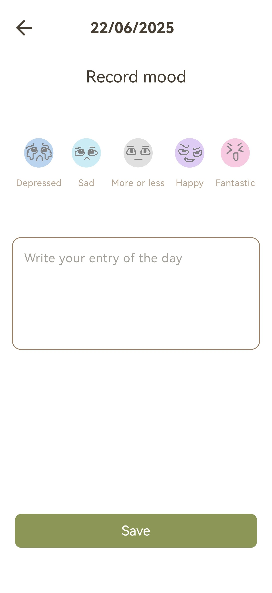

16. **Motivational Letter:** Receive a personalized, uplifting message in response to your mood
    entry.